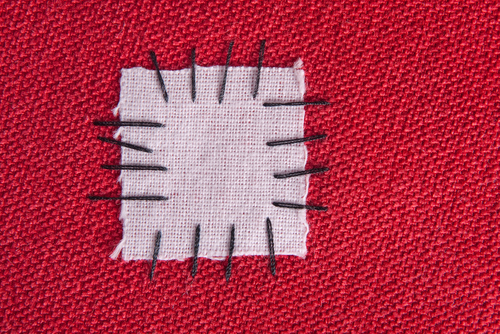
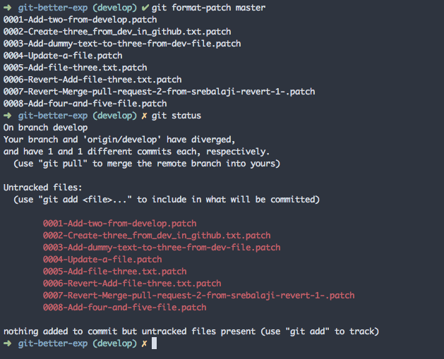
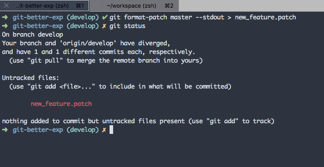
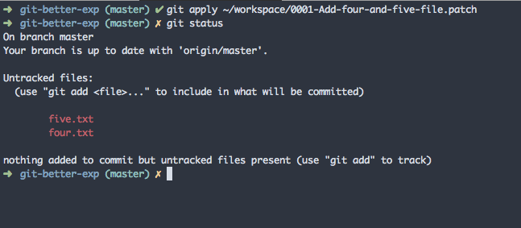
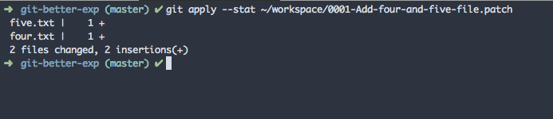

<br/><br/>

Git provides the option to create patch files. These patch files contain changes that can be used elsewhere.

For example, you can create a patch file in your local repo. Then you can send it to others to use the patch in their local.

Some people will also create a patch to have it as a backup for later use.

<br/>

### Creating git patch

```bash
git format-patch <target-branch>
```


In the above example, you can see that I have mentioned **master** as the target branch. So Git will fetch all commits from the current branch (develop) which are ahead of master.

Then it creates a patch file for each commit. As you can see there are eight patch files created.

<br/>

#### Creating a single patch file for multiple commits

```bash
git format-patch <target-branch> --stdout patch_name.patch
```


In the above example, a single patch file is created with a given name for all the commits.

<br/>

#### Creating a patch from git commits

Sometimes, you are interested in creating a patch from a selective commit. In this case, you can use

```bash
git format-patch -1 <commit-hash>
```

The above command will only consider the respective commit hash to make a patch.

<br/>

### Applying git patch

Now you know how to create a patch file. Let’s see how to apply the git patch if you got one.

```bash
git apply <patch_file_path>
```


You can see that I have applied a patch file from the destined path. Then the changes are applied from the patch file. Then you can review those changes and do the commit.

```bash
git apply --stat <patch_file_path>
```

This command will not apply the patch but will show the changes stat.



<br/>

#### Using git am

```bash
git am <patch_file_path>
```

This command will apply the patch and a new commit is created from the changes. Unlike **apply** it won’t be just used to preview the changes. **git am** will create new commits.

Patches are helpful if you want to share code with others without using your centralized repo. And it is also useful to take a backup of your work for later purposes.

Thank you for reading :)

This post is part of my newsletter GitBetter. If you want to level up your game in Git, you can subscribe ot it.

[GitBetter](https://gitbetter.substack.com/)