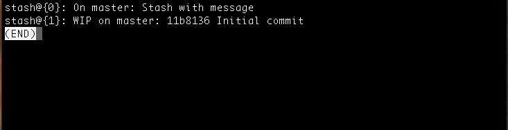
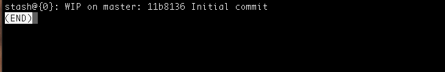
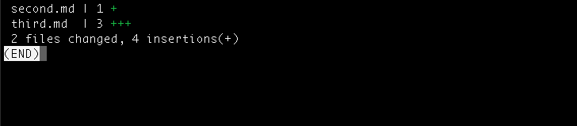

If you have been using Git for a while you might have used Git stash. It’s one of the useful features in Git.

Here are some of the useful tricks I learned about Git stash last week.

1.  Git stash save
2.  Git stash list
3.  Git stash apply
4.  Git stash pop
5.  Git stash show
6.  Git stash branch (name)
7.  Git stash clear
8.  Git stash drop

### **Git stash save**

This command is like Git stash. But this command comes with various options. I will discuss some important options in this post.

**Git stash with message**

```bash
git stash save “Your stash message”.
```

The above command stashes with a message. We will see how this is helpful in a bit.

**Stashing untracked files**

You can also stash untracked files.

```bash
git stash save -u

or

git stash save --include-untracked
```

#### **Git stash list**

Before discussing this command, let me tell you something about how stash works.

When you Git stash or Git stash save, Git will actually create a Git commit object with some name and then save it in your repo.

So it means that you can view the list of stashes you made at any time.

```bash
git stash list
```

See the example below:



You can see the list of stashes made. And the most recent stash made is in the top.

And you can see that the top stash is given a custom message (using Git stash save “message” ).

#### **Git stash apply**

This command takes the top most stash in the stack and applies it to the repo. In our case it is **stash@{0}**

If you want to apply some other stash you can specify the stash id.

Here’s the example:

```bash
git stash apply stash@{1}
```

#### **Git stash pop**

This command is very similar to stash apply but it deletes the stash from the stack after it is applied.

Here’s the example:



As you can see the top stash is deleted and **stash@{0}** is updated with older stash.

Likewise, if you want a particular stash to pop you can specify the stash id.

```bash
git stash pop stash@{1}
```

#### **Git stash show**

This command shows the summary of the stash diffs. The above command considers only the latest stash.

Here’s the example:



If you want to see the full diff, you can use

```bash
git stash show -p
```

Likewise with other commands, you can also specify the stash id to get the diff summary.

```bash
git stash show stash@{1}
```

#### **Git stash branch (name)**

This command creates a new branch with the latest stash, and then deletes the latest stash ( like stash pop).

If you need a particular stash you can specify the stash id.

```bash
git stash branch (name) stash@{1}
```

This will be useful when you run into conflicts after you’ve applied the stash to the latest version of your branch.

#### **Git stash clear**

This command deletes all the stashes made in the repo. It maybe impossible to revert.

#### **Git stash drop**

This command deletes the latest stash from the stack. But use it with caution, it maybe be difficult to revert.

You can also specify the stash id.

```bash
git stash drop stash@{1}
```

Hope you got some useful tricks about Git stash.

If you enjoyed the article try to give some claps and share it :) :)
